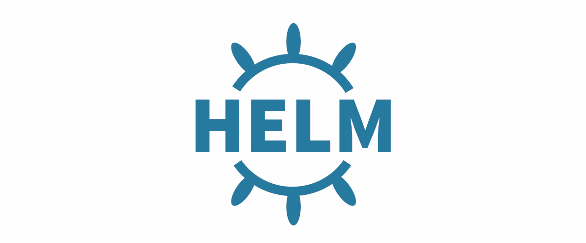

# My Helm Chats repository

[https://fillswim.github.io/HelmChats/](https://fillswim.github.io/HelmChats/)

## Создание Helm Chart

Структура Helm Chart:
```bash
+---HelmChats 
|   +---My-Template-HelmChart 
|   |   +---templates 
|   |   |   \---deployment.yaml 
|   |   |   \---hpa.yaml 
|   |   |   \---service.yaml 
|   |   |   \---ingress.yaml 
|   |   \---Chart.yaml 
|   |   \---values.yaml 
|   \---index.yaml 
|   \---my-template-helmchart-0.0.6.tgz 
|   \---README.md
```

#### 1. Запаковать папку с helm chart в архив
```bash
helm package My-Template-HelmChart/
```

#### 2. Обновить index.yaml
```bash
helm repo index --url https://fillswim.github.io/HelmChats/ .
```
#### 3. Push в GitHub


## Использование репозитория с Helm Chart

#### Добавление репозитория на мастер ноду в Kubernetes
```bash
helm repo add fillswimrepo https://fillswim.github.io/HelmChats/
```

#### Обновить сведения из helm репозитория на мастер ноде
```bash
helm repo update
```

#### Просмотр helm chart в репозитории
```bash
helm search repo fillswimrepo
```

## Развертывание приложения при помощи Helm Chart

Просмотр всех установленных при помощи helm chart приложений:
```bash
helm list
```

#### Развертывание GifService в K8s 
с чартом из репозитория с параметрами, прописанными в файле
```bash
helm install \
	my-gifservice \
	fillswimrepo/my-template-helmchart \
	-f /home/fill/K8SManifests/HelmChart_values_gifservice.yaml
```

с чартом из репозитория с параметрами, прописанными в командной строке
```bash
helm install \
	my-gifservice \
	fillswimrepo/my-template-helmchart \
	--set container.image=fillswim/mygifservice-githubactions:latest \
	--set containerPort=8080 \
	--set servicePort=8080 \
	--set cpuUtilization=50 \
	--set memoryUtilization=80 \
	--set host=gifservice.fillswim.com
```

чартом из папки
```bash
helm install \
	my-gifservice \
	My-Template-HelmChart/ \
	-f /home/fill/K8SManifests/HelmChart_values_gifservice.yaml
```

## Проверка работы приложения

#### [https://gifservice.fillswim.com](https://gifservice.fillswim.com/swagger-ui/index.html)

проверка один раз:
```bash
curl -Is https://gifservice.fillswim.com/swagger-ui/index.html
```

посекундная проверка:
```bash
while true
do
	my_date="$(date +"%T")"
	my_status="$(curl -Is https://gifservice.fillswim.com/swagger-ui/index.html | head -n 1)"
    printf "Time: %s , Status: %s\n" "$my_date" "$my_status"
    sleep 1
done
```

## Обновление приложения, развернутого с помощью helm chart

чартом из репозитория с параметрами, прописанными в файле
```bash
helm upgrade \
	my-gifservice \
	fillswimrepo/my-template-helmchart \
	-f /home/fill/K8SManifests/HelmChart_values_gifservice.yaml
```

чартом из репозитория с параметрами, прописанными в командной строке
```bash
helm upgrade \
	my-gifservice \
	fillswimrepo/my-template-helmchart \
	--set container.image=fillswim/mygifservice-githubactions:latest \
	--set containerPort=8080 \
	--set servicePort=8080 \
	--set cpuUtilization=60 \
	--set memoryUtilization=85 \
	--set host=gifservice.fillswim.com
```

## Удаление приложения с K8s

```bash
helm uninstall my-gifservice
```